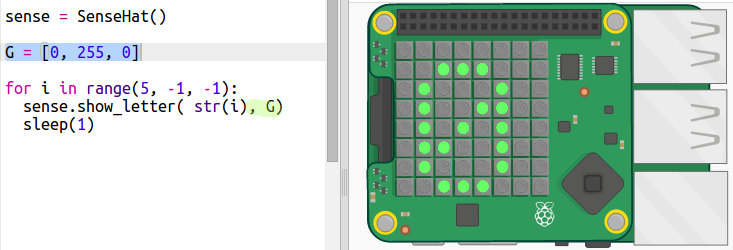

## العد التنازلي للنص

دعنا أولاً نعد تنازلياً من 5 إلى 0 من خلال عرض الأرقام باستخدام شاشة عرض البكسلات الخاصة بلوحة Sense Hat.

+ شغل العناصر الرئيسية لمؤقت العد التنازلي <a href="http://jumpto.cc/timer-go" target="_blank">jumpto.cc/timer-go</a>
    
    **تم تضمين كود خاص لاعداد ال Sense Hat.**

+ سوف تبدأ أولًا بالعد حتى الرقم 5 لأن ذلك أسهل. أضف الكود المضلل أسفل النص البرمجي الخاص بك:
    
    
    
    الأمر `sense.show_letter()` يعرض حرف واحد على لوحة Sense HAT. لا يسمح بالأرقام ، لذلك يجب عليك استخدام `str ()` لتغيير الرقم إلى صيغه قابله للعرض.
    
    يشير الأمر `sleep(1)` للإنتظار ثانية واحدة قبل أن ينتقل الكود للخطوة التالية.

+ في نظام البايثون؛ يُعيد الأمر `range(1, 6)` الأرقام من 1 إلى 5. لكنك لست مضطرًا للعد بتلك الآلية:
    
    + يَحسب النطاق (1, 10, 2) تصاعدياً بمضاعفات ثنائية معطيًا الأرقام 1,3,5,7,9
    + يَحسب النطاق (5, 0,-1) الأرقام بطريقة تنازلية فردية معطيًا الأرقام 5, 4, 3, 2, 1 ويتم اقصاء الرقم -1
    
    قم بتغيير النطاق في الكود الخاص بك بحيث يبدأ بالعد تنازلياً حتى الصفر:
    
    

+ ليس من الضروري أن يظهر الرقم في اللدات باللون الأبيض، يمكن لـ Sense HAT عرض العديد من الألوان. إذ يستخدم النموذج اللوني RGB (أحمر RED، أخضر Green، أزرق Blue).
    
    جرب استخدام اللون الأخضر:
    
    