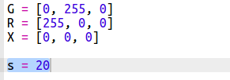

## إنشاء مؤقت نقطي

طريقة أخرى لإنشاء المؤقت هي بتحويل البكسلات من الأخضر إلى الأحمر.

+ قم بتشغيل المؤقت النقطي على ترنكيت من هنا: <a href="http://jumpto.cc/dot-timer-go" target="_blank">jumpto.cc/dot-timer-go</a>

+ أضف متغير `X` لاستخدامها في إيقاف تشغيل وحدات البكسل؛ ليس لها قيمة حمراء أو خضراء أو زرقاء في قيمة RGB:
    
    

+ أضف متغير يدعى `s` لعدد الثواني التي تريد حسابها.
    
    

+ يمكنك إعطاء لوحة Sense HAT قائمة من 64 (8×8) لون لعرضها، بدءًا من أعلى اليسار باتجاه الأسفل في وقت واحد.
    
    دعنا ننشئ قائمة بالألوان من خلال إنشاء نقطة بكسل خضراء لكل ثانية نريد حسابها ، وتعيين باقي وحدات البكسل البالغ عددها 64 بكسل بحيث يتم إيقاف تشغيلها. يحتوي متغير `timer` على قائمة الألوان المقرر عرضها ويبدًا فارغًا:
    
    

+ لنقم الآن بتشغيل العد التنازلي من خلال تحويل بكسل واحد إلى اللون الأحمر كل ثانية:
    
    

+ يمكنك أيضًا أن تضيف وميضًا للعرض **at the end** عن طريق تشغيل وحدات البكسل وإيقافها:
    
    