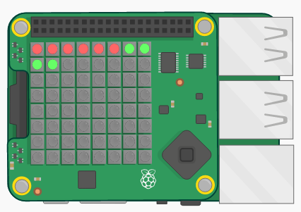

## Úvod

In this project you will use the coloured pixels on the Sense HAT to display a countdown timer.

### Co budeš dělat

Click **Run** to start the countdown timer:

  <iframe src="https://trinket.io/embed/python/dfdfcc6814?outputOnly=true&start=result" width="600" height="500" frameborder="0" marginwidth="0" marginheight="0" allowfullscreen mark="crwd-mark">
</iframe> 

### Co se naučíš

Tento projekt zahrnuje prvky z následujících částí výukových osnov [ Raspberry Pi Digitální bastlení ](http://rpf.io/curriculum)"}{:target="_blank"}:

+ [Apply basic programming constructs to solve a problem](https://www.raspberrypi.org/curriculum/programming/builder){:target="_blank"}

### Další informace pro učitele

Potřebujete-li tento projekt vytisknout, použijte verzi [pro-tisk](https://projects.raspberrypi.org/en/projects/countdown-timer/print){:target="_blank"}.

Použijte odkaz v zápatí pro přístup ke GitHub úložišti tohoto projektu, obsahující ve složce "en/resources" veškeré zdroje, včetně příkladu dokončeného projektu.