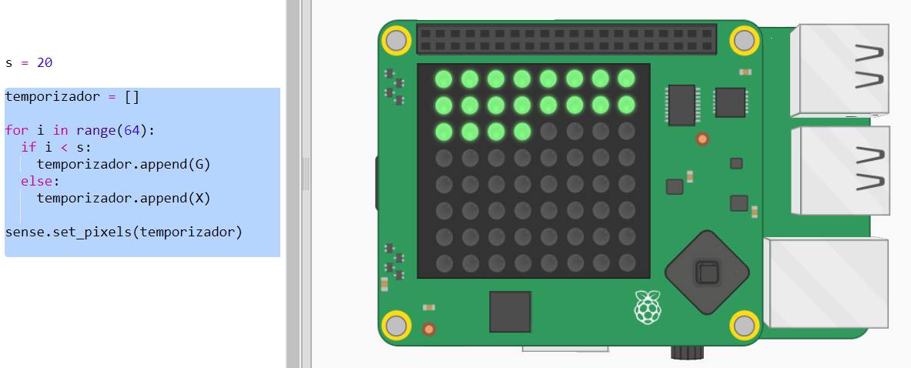
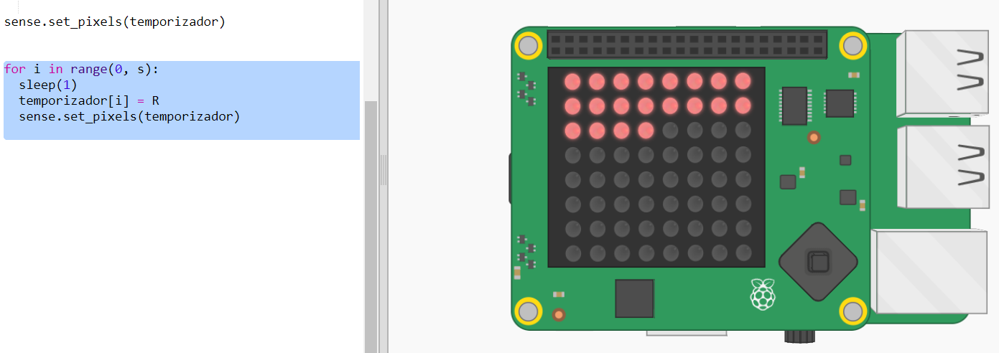
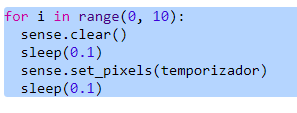

## Crea un temporizador de puntos

Otra forma de crear un temporizador es cambiando los píxeles de verde a rojo.

+ Abre el Temporizador de puntos inicial en Trinket: <a href="http://jumpto.cc/dot-timer-go" target="_blank">jumpto.cc/dot-timer-go</a>

+ Agrega una variable ` X ` para utilizar cuando desactives píxeles: no tiene color rojo, verde o azul en su valor RGB:
    
    

+ Agrega una variable llamada ` s ` para la cantidad de segundos que desea contar.
    
    

+ Puedes darle al Sense HAT una lista de 64 (8 × 8) colores para mostrar, comenzando desde la parte superior izquierda y trabajando hacia abajo una fila a la vez.
    
    Creemos una lista de colores al crear un punto píxel verde por cada segundo que queramos contar y configurando el resto de los 64 píxeles para que estén apagados. La variable `temporizador ` contiene la lista de colores para mostrarlos y comienza vacía:
    
    

+ Ahora vamos a ejecutar la cuenta regresiva convirtiendo un píxel a rojo cada segundo:
    
    

+ También puedes mostrar la pantalla ** al final ** activando y desactivando los píxeles:
    
    