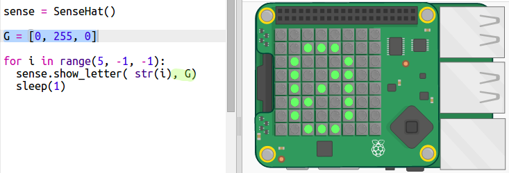

## Compte à rebours du texte

Tout d'abord, on compte à rebours de 5 à 0 en affichant des nombres sur la matrice de pixels du Sense HAT.

+ Ouvre le trinket «compte à rebours » : <a href="http://jumpto.cc/timer-go" target="_blank">jumpto.cc/timer-go</a>
    
    **Le code de configuration du Sense HAT a été inclus pour toi.**

+ Tu vas compter jusqu'à 5 d'abord parce que c'est plus facile à faire. Ajoute le code surligné au bas de ton script:
    
    
    
    La commande `sense.show_letter()` affiche une seule lettre sur le Sense HAT. Il n'autorise pas les nombres, donc tu dois utiliser `str()` pour changer le nombre en un format qu'il peut afficher.
    
    `sleep(1)` attend une seconde avant que le code ne passe à l'étape suivante.

+ En Python, `range(1, 6)` retourne les nombres 1 à 5. Tu n'as cependant pas à compter dans ceux-ci :
    
    + range(1, 10, 2) compterait par deux, donnant 1, 3, 5, 7 et 9
    + range(5, 0, -1) compte à rebours en enlevant -1, donnant 5, 4, 3, 2, 1
    
    Modifie la plage de ton code pour qu'il décompte jusqu'à 0 :
    
    

+ Le nombre sur les LED n'a pas besoin d'être blanc — le Sense HAT peut afficher beaucoup de couleurs. Il utilise le codage de couleurs RGB (rouge, vert et bleu).
    
    Essaie d'utiliser le vert:
    
    