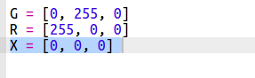
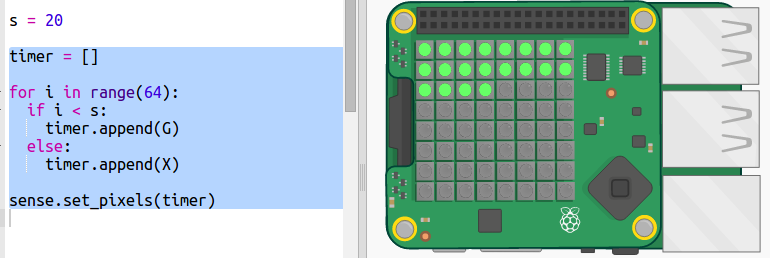
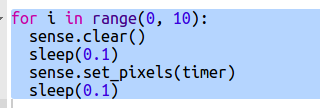

## Création d'un chronomètre de point

Une autre façon de créer un chronomètre est de transformer les pixels du vert au rouge.

+ Ouvre le trinket de démarrage du chronomètre point : <a href="http://jumpto.cc/dot-timer-go" target="_blank">jumpto.cc/dot-timer-go</a>

+ Ajoute une variable `X` à utiliser pour désactiver les pixels — elle n'a pas de rouge, vert ou bleu dans sa valeur RGB :
    
    

+ Ajoute une variable appelée `s` pour le nombre de secondes que tu veux compter.
    
    

+ Tu peux donner au Sense HAT une liste de 64 couleurs (8×8) à afficher, en partant du haut à gauche et en travaillant une ligne à la fois.
    
    Créons une liste de couleurs en créant un point vert pour chaque seconde que nous voulons compter, et en réglant le reste des 64 pixels afin qu'ils soient éteints. La variable `timer` contient la liste des couleurs à afficher et commence vide :
    
    

+ Maintenant, lançons le compte à rebours en tournant un pixel rouge chaque seconde:
    
    

+ Tu peux également faire clignoter l'affichage **à la fin** en allumant et en éteignant les pixels :
    
    