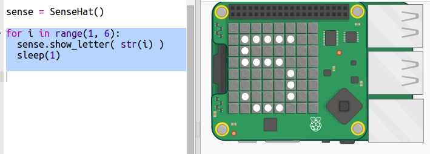
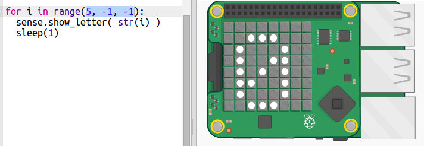

## पाठ की उलटी गिनती

पहले हम Sense Hat के पिक्सेल डिस्प्ले का उपयोग करके संख्याओं को प्रदर्शित करते हुए 5 से 0 तक उलटी गिनती करें।

+ काउंटडाउन टाइमर प्रारंभक Trinket को खोलें: <a href="http://jumpto.cc/timer-go" target="_blank">jumpto.cc/timer-go</a>
    
    **आपके लिए Sense HAT को सेट करने का कोड शामिल किया गया है।**

+ आप पहले 5 तक गिनती करने जा रहे हैं क्योंकि ऐसा करना आसान है। अपनी स्क्रिप्ट के नीचे हाइलाइट किया गया कोड जोड़ें:
    
    
    
    `sense.show_letter()` कमांड से Sense HAT पर एक अकेला अक्षर प्रदर्शित होता है। इसमें संख्याओं की अनुमति नहीं होती है, इसलिए आपको संख्या को एक ऐसे प्रारूप में बदलने के लिए `str()` का उपयोग करना होगा जिसे वह प्रदर्शित हो सके ।
    
    `sleep(1)` एक सेकंड इंतजार करता है कोड के अगले चरण पर आगे बढ़ने से पहले।

+ Python में, `range(1, 6)` 1 से 5 तक की संख्या लौटाता है। हालांकि आपको एक-एक करके नहीं गिनना होता है:
    
    + range(1, 10, 2) में दो-दो करके गिनती होगी, जिससे आपको 1, 3, 5, 7, और 9 की संख्याएँ मिलेंगी
    + range(5, 0, -1) में -1 घटाकर काउंट डाउन होता है, जिससे 5, 4, 3, 2, 1 की संख्या मिलती है
    
    अपने कोड में रेंज बदलें ताकि इसमें 0 तक उलटी गिनती हो सके:
    
    

+ LED पर संख्या का सफेद होना ज़रूरी नहीं है - Sense HAT बहुत से रंग प्रदर्शित कर सकता है। इसमें RGB रंगों (लाल, हरा और नीला) का उपयोग होता है।
    
    हरे रंग का उपयोग करके देखें:
    
    