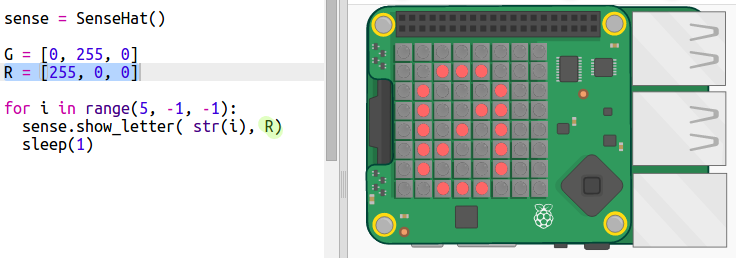

\--- challenge \---

## चुनौती: कोई दूसरा रंग

क्या आप रंग को अपनी पसंद के रंग में बदल सकते हैं?

यहाँ एक और उदाहरण है जिसमें लाल रंग का उपयोग हुआ है:

R, G, और B मानों के साथ प्रयोग करने का प्रयास करें — आप 0 से 255 तक किसी भी संख्या का उपयोग कर सकते हैं)। `[255, 0, 255]` कौन सा रंग है?

आप किसी विशिष्ट रंग के लिए RGB मान <a href="http://jumpto.cc/colours" target="_blank">यहाँ</a> भी देख सकते हैं।

\--- /challenge \---