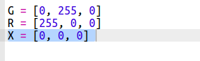
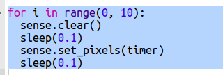

## डॉट टाइमर बनाना

टाइमर बनाने का एक और तरीका यह है कि पिक्सल को हरे से लाल रंग में बदल दिया जाए।

+ डॉट टाइमर स्टार्टर trinket को खोलें: <a href="http://jumpto.cc/dot-timer-go" target="_blank">jumpto.cc/dot-timer-go</a>

+ पिक्सेल बंद करने के लिए वेरिएबल को `X` जोड़ें - इसके RGB मान में कोई लाल, हरा या नीला रंग नहीं है:
    
    

+ आप जितने सेकंड की गिनती करना चाहते हैं उसके लिए `s` नामक एक वेरिएबल जोड़ें।
    
    

+ आप Sense HAT को प्रदर्शित करने के लिए 64 (8 × 8) रंगों की एक सूची दे सकते हैं, जो ऊपर बाईं ओर से शुरू होते हैं और एक समय में एक पंक्ति में काम करते हैं।
    
    आइए हम जितने सेकंड की गिनती करना चाहते हैं, उस प्रत्येक सेकंड के लिए हरे रंग की पिक्सेल डॉट बनाकर रंगों की सूची बनाएँ, और बाकी 64 पिक्सेल को सेट कर दें ताकि वे बंद हो जाएँ। `timer` वेरिएबल में प्रदर्शित किए जाने वाले रंगों की सूची शामिल है और यह खाली चलना शुरू होता है:
    
    

+ आइए अब हम हर सेकंड एक पिक्सेल को लाल रंग में बदल कर उलटी गिनती चलाएँ:
    
    

+ आप पिक्सल को चालू और बंद करके डिस्प्ले को **अंत में** भी फ्लैश कर सकते हैं:
    
    