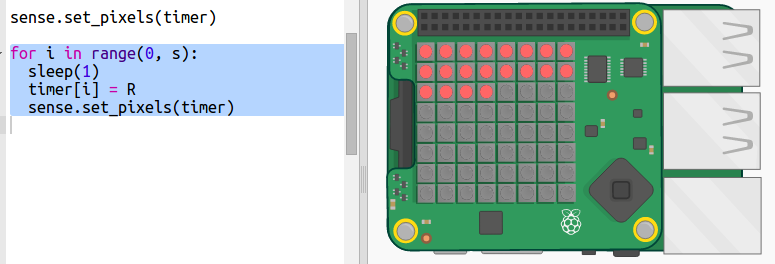

## Een timer met stippen maken

Een andere manier om een timer te maken, is door pixels van groen in rood te veranderen.

+ Open de stippentimer starttrinket: <a href="http://jumpto.cc/dot-timer-go" target="_blank">jumpto.cc/dot-timer-go</a>

+ Voeg een variabele `X` toe om pixels uit te kunnen schakelen — het heeft geen rood, groen of blauw in zijn RGB waarde:
    
    

+ Voeg een variabele met de naam `s` toe voor het aantal seconden dat je wilt tellen.
    
    

+ Je kunt de Sense HAT een lijst van 64 (8 × 8) kleuren geven om weer te geven, beginnend linksboven en rij voor rij naar beneden.
    
    Laten we een lijst met kleuren maken door een groene pixelpunt te maken voor elke seconde die we willen tellen, en de rest van de 64 pixels zo in te stellen dat ze zijn uitgeschakeld. De variabele `timer` bevat de lijst met weer te geven kleuren en begint leeg:
    
    

+ Laten we nu het aftellen uitvoeren door elke seconde een pixel rood te maken:
    
    

+ Je kunt ook het scherm **aan het einde** laten knipperen door de pixels in en uit te schakelen:
    
    