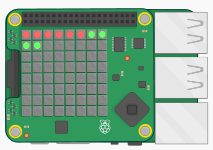

## Introdução

In this project you will use the coloured pixels on the Sense HAT to display a countdown timer.

### O que vais fazer

Click **Run** to start the countdown timer:

  <iframe src="https://trinket.io/embed/python/dfdfcc6814?outputOnly=true&start=result" width="600" height="500" frameborder="0" marginwidth="0" marginheight="0" allowfullscreen mark="crwd-mark">
</iframe> 

### O que vais aprender

Este projeto abrange elementos das seguintes vertentes do [Currículo Raspberry Pi Digital Making](http://rpf.io/curriculum){: target = "_ blank"}:

+ [Apply basic programming constructs to solve a problem](https://www.raspberrypi.org/curriculum/programming/builder){:target="_blank"}

### Informações adicionais para educadores

Se você precisar imprimir este projeto, por favor, use a [versão para impressão](https://projects.raspberrypi.org/en/projects/countdown-timer/print){: target = "_ blank"}.

Use o link no rodapé para acessar o repositório do GitHub para este projeto, que contém todos os recursos (incluindo um exemplo de projeto concluído) na pasta 'en / resources'.