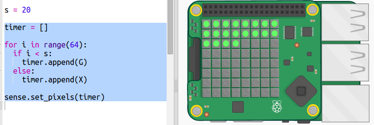

## Creating a dot timer

Another way to create a timer is by turning pixels from green to red.

+ Open the dot timer starter trinket: <a href="http://jumpto.cc/dot-timer-go" target="_blank">jumpto.cc/dot-timer-go</a>

+ Add a variable `X` to use to turn pixels off — it has no red, green, or blue in its RGB value:
    
    

+ Add a variable called `s` for the number of seconds you want to count.
    
    

+ You can give the Sense HAT a list of 64 (8×8) colours to display, starting from the top left and working down a row at a time.
    
    Let's create a list of colours by creating a green pixel dot for each second we want to count, and setting the rest of the 64 pixels so they are off. The `timer` variable contains the list of colours to display and starts off empty:
    
    

+ Now let's run the countdown by turning a pixel red every second:
    
    

+ You could also flash the display **at the end** by turning the pixels on and off:
    
    